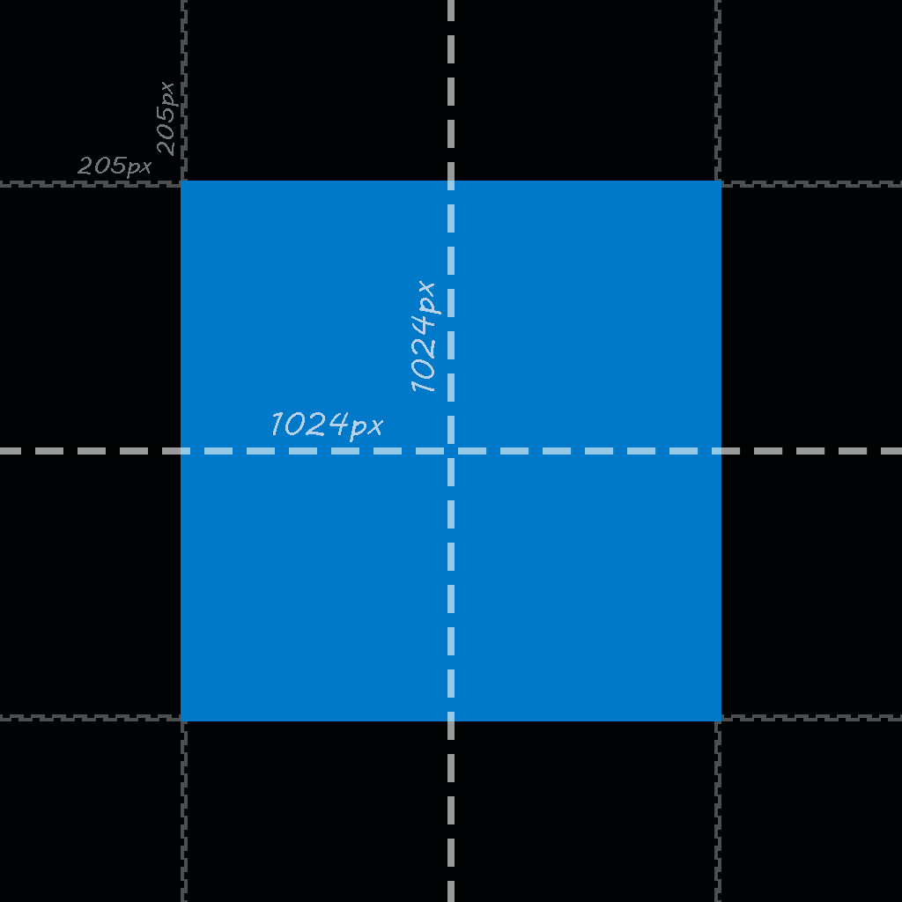

  

<h1 align='center'>vs-presence</h1>

vs-presence is an extension fo Visual Studio Code that allows rich precense in your discord status!
This extension is based off of ICrawl's [discord-vscode](https://github.com/iCrawl/discord-vscode)
with the main difference being I will accept most pull requests as long as they make sense and don't break
any current features!

## Key Features
- Shows what you are doing/editing in vscode
- Wide language support
- Highly Customizable

## Contributing

1. [Fork This Repo](https://github.com/NobUwU/vs-presence/fork)
2. Clone your fork `git clone fork_url`
3. Create branch for your feature `git checkout -b cool-feature`
4. Track any new files `git add .`
5. Commit your changes `git commit -am "add cool feature"`
6. Push changes `git push -u origin cool-feature`
7. Submit a pull request displaying what has been added 👍

### New Langs
- Add file extensions to langs.json
- Add icon to icons folder

### Icons
- Use [Material Icons](https://github.com/PKief/vscode-material-icon-theme) if possible
- Icon format must be jpg
- No Transparent Backgrounds!

#### Spacing Considerations
- Icon 1024/1024px
- 205px of "BlackSpace" on outside

## Legal Author Mumbo Jumbo

Created and Maintained by [Nobu](https://github.com/NobUwU)

Based off of [ICrawl's](https://github.com/iCrawl) [discord-vscode](https://github.com/iCrawl/discord-vscode)
